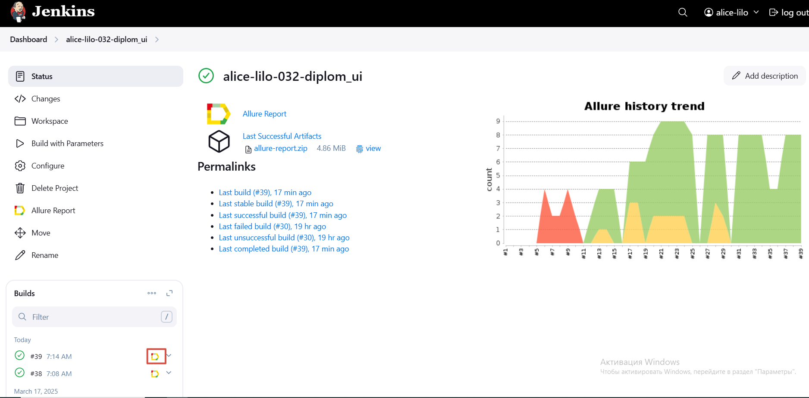
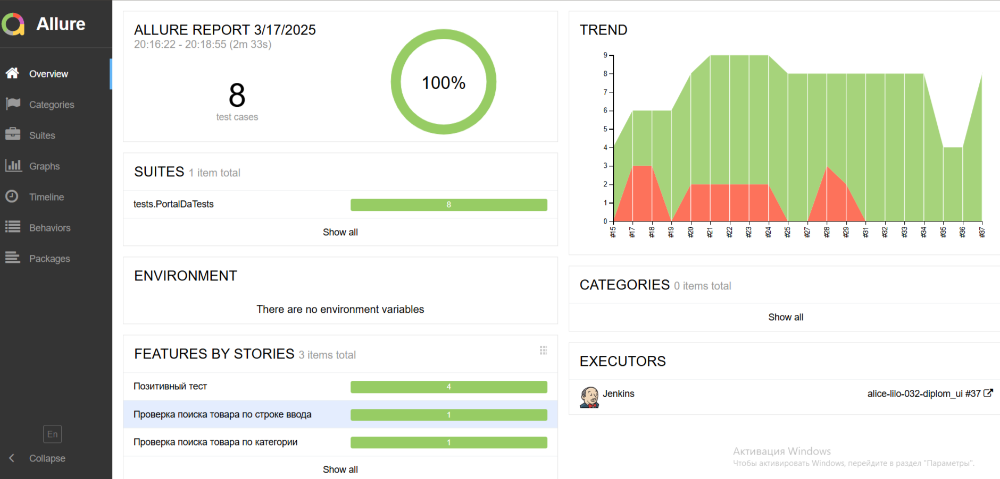
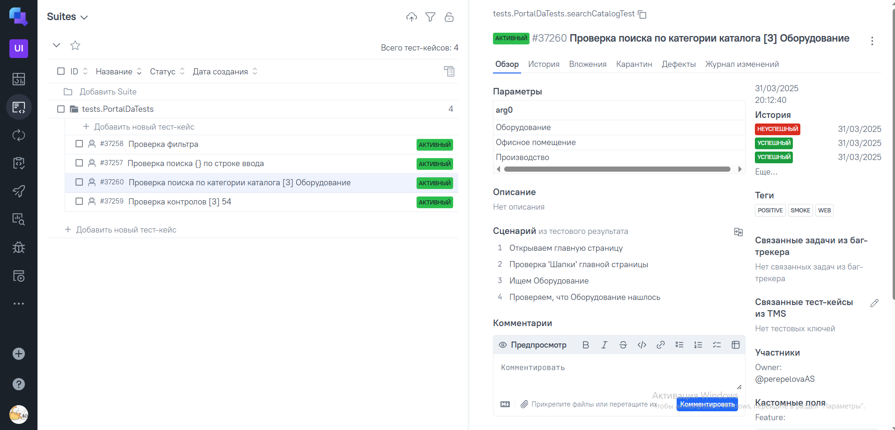
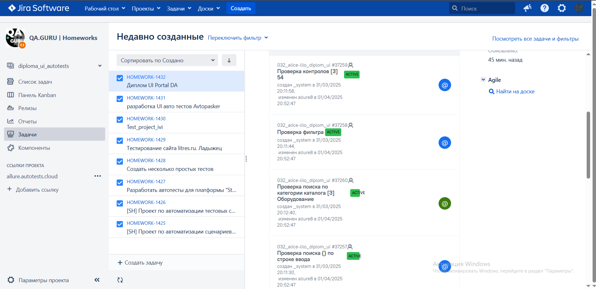
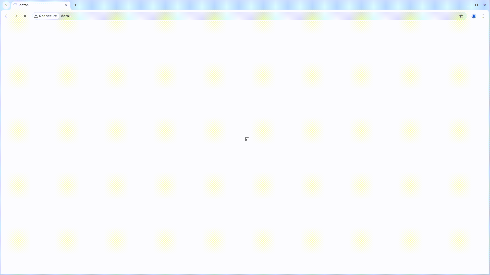

# ui_project
<h1 align="center">Portal DA – сервис от Сбербанка, 
предназначенный для покупки и продажи залогов и непрофильных активов</h1>
<a id="cases"></a>

<a id="autotests"></a>
<h1 align="center">Проект по автоматизации тестирования онлайн сервиса от Сбербанка</h1>

<p align="center">
<a href="https://portal-da.ru/"> </a>
</p>

> 

##  Содержание:
- <a href="#tools"> Технологии и инструменты</a>
- <a href="#cases"> Тест-кейсы</a>
- <a href="#autotests"> Запуск автотестов</a>
- <a href="#jenkins"> Сборка в Jenkins</a>
- <a href="#allureReport"> Пример Allure-отчета</a>
- <a href="#allure"> Интеграция с Allure TestOps</a>
- <a href="#jira"> Интеграция с Jira</a>
- <a href="#tg"> Уведомления в Telegram с использованием бота</a>
- <a href="#video"> Видео примера запуска тестов в Selenoid</a>
<a id="tools"></a>
## Технологии и инструменты

| Java                                                                                                    | IntelliJ Idea                                                                                                                | Allure                                                                                                                    | Allure TestOps                                                                                                      | GitHub                                                                                                    | JUnit 5                                                                                                           | Gradle                                                                                                   |                                                                                                         Jenkins | Jira                                                                                                                         |
|:--------------------------------------------------------------------------------------------------------|------------------------------------------------------------------------------------------------------------------------------|---------------------------------------------------------------------------------------------------------------------------|---------------------------------------------------------------------------------------------------------------------|-----------------------------------------------------------------------------------------------------------|-------------------------------------------------------------------------------------------------------------------|----------------------------------------------------------------------------------------------------------|----------------------------------------------------------------------------------------------------------------:|------------------------------------------------------------------------------------------------------------------------------|
| <a href="https://www.java.com/"></a> | <a id ="tech" href="https://www.jetbrains.com/idea/"></a> | <a href="https://github.com/allure-framework"></a> | <a href="https://qameta.io/"></a> | <a href="https://github.com/"></a> | <a href="https://junit.org/junit5/"></a> | <a href="https://gradle.org/"></a> | <a href="https://www.jenkins.io/"></a> | <a href="https://www.atlassian.com/ru/software/jira"></a> |


Тесты написаны на языке <code>Java</code> с использованием фреймворка для автоматизации тестирования <code>Selenide</code>, сборщик - <code>Gradle</code>.

<code>JUnit 5</code> задействован в качестве фреймворка модульного тестирования.
При прогоне тестов для удаленного запуска используется <code>Selenoid</code>.

Для удаленного запуска реализована джоба в <code>Jenkins</code> с формированием Allure-отчета и отправкой результатов в <code>Telegram</code> при помощи бота.

Содержание Allure-отчета для каждого кейса:
* Шаги теста и результат их выполнения
* Скриншот страницы на последнем шаге (возможность визуально проанализировать, почему упал тест)
* Page Source (возможность открыть source страницы в новой вкладке и посмотреть причину падения теста)
* Логи консоли браузера
* Видео выполнения автотеста.

____
<a id="cases"></a>
## 🕵️‍♂️ Тест-кейсы
Auto:
- Проверка поиска по категории каталога
- Проверка поиска по строке ввода
- Проверка контролов
- Проверка применения Фильтров
- Проверка заголовков
- Проверка перехода на страницу "Помощь"
- Проверка перехода на скачивание приложения в RuStore

<a id="autotests"></a>
____
## ▶️ Запуск автотестов

### Запуск тестов из терминала

Для запуска тестов локально использовать команду ниже:
```
./gradlew clean test
```
Удаленный запуск тестов:
```
gradle clean test 
"-Dbrowser=${BROWSER}" 
"-DbrowserVersion=${BROWSER_VERSION}" 
"-DbrowserSize=${BROWSER_SIZE}" 
"-DremoteUrl=${REMOTE_URL}"
```

---
<a id="jenkins"></a>
##  </a> Сборка в <a target="_blank" href="https://jenkins.autotests.cloud/job/alice-lilo-032-diplom_ui/"> Jenkins </a>
Для доступа в Jenkins необходима регистрация на ресурсе [Jenkins](https://jenkins.autotests.cloud/)
Для запуска сборки необходимо перейти в раздел <code>Build with parameters</code>, выбрать необходимые параметры и нажать кнопку <code>Build</code>.
###  Параметры сборки в Jenkins:
- TASK (набор тестов для запуска)
- ENVIRONMENT (стенд для выполнения)
- BROWSER (браузер для запуска)
- BROWSER_VERSION (версия браузера)
- BROWSER_SIZE (размер окна браузера)
- 
<p align="center">

</p>
После выполнения сборки, в блоке <code>Build History</code> напротив номера сборки появится значок <code>Allure Report</code>  при клике на который откроется страница с сформированным html-отчетом.

____
<a id="allureReport"></a>
##  </a> Пример <a target="_blank" href="https://jenkins.autotests.cloud/job/alice-lilo-032-diplom_ui/53/allure/"> Allure-отчета </a>
<p align="center">

</p>

---
<a id="allure"></a>
##  </a> Интеграция с <a target="_blank" href="https://allure.autotests.cloud/project/4693/dashboards"> Allure TestOps </a>
На *Dashboard* в <code>Allure TestOps</code> видна статистика количества тестов. Новые тесты, а так же результаты прогона приходят по интеграции при каждом запуске сборки.
<p align="center">

</p>

____
<a id="jira"></a>
##  </a> Интеграция с <a target="_blank" href="https://jira.autotests.cloud/browse/HOMEWORK-1432"> Jira </a>
Реализована интеграция <code>Allure TestOps</code> с <code>Jira</code>, в задаче отображается, какие тест-кейсы были написаны в рамках задачи и результат их прогона.
<p align="center">

</p>

____
<a id="tg"></a>
##  Уведомления в Telegram с использованием бота
После завершения сборки, бот, созданный в <code>Telegram</code>, автоматически обрабатывает и отправляет сообщение с отчетом о прогоне тестов в специально настроенный чат.
<p align="center">

</p>

____
<a id="video"></a>
##  Видео примера запуска тестов в Selenoid
В отчетах Allure для каждого теста прикреплен не только скриншот, но и видео прохождения теста
<p align="center">
  

</p>
